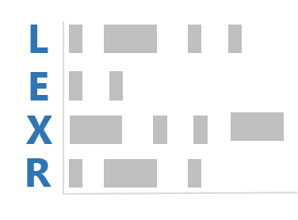

```{r, echo=FALSE}
desc <- suppressWarnings(readLines("DESCRIPTION"))
regex <- "(^Version:\\s+)(\\d+\\.\\d+\\.\\d+)"
loc <- grep(regex, desc)
ver <- gsub(regex, "\\2", desc[loc])
verbadge <- sprintf('<a href="https://img.shields.io/badge/Version-%s-orange.svg"></a></p>', ver, ver)
````

[](https://travis-ci.org/trinker/lexr)
[](https://coveralls.io/r/trinker/lexr?branch=master)
`r verbadge`



```{r, echo=FALSE}
library(knitr)
knit_hooks$set(htmlcap = function(before, options, envir) {
  if(!before) {
    paste('<p class="caption"><b><em>',options$htmlcap,"</em></b></p>",sep="")
    }
    })
knitr::opts_knit$set(self.contained = TRUE, cache = FALSE)
knitr::opts_chunk$set(fig.path = "tools/figure/")
```

**lexr** is an R package designed to quickly make lexical dispersion plots.  The user will typically be interested in the `lexical_dispersion_plot` function.

# Installation

To download the development version of **lexr**:

Download the [zip ball](https://github.com/trinker/lexr/zipball/master) or [tar ball](https://github.com/trinker/lexr/tarball/master), decompress and run `R CMD INSTALL` on it, or use the **pacman** package to install the development version:

```r
if (!require("pacman")) install.packages("pacman")
pacman::p_load_gh("trinker/lexr")
```

# Contact

You are welcome to:
* submit suggestions and bug-reports at: <https://github.com/trinker/lexr/issues>
* send a pull request on: <https://github.com/trinker/lexr/>
* compose a friendly e-mail to: <tyler.rinker@gmail.com>

# Examples

A collection of different lexical dispersion plots made with **lexr** + **qdap** packages.

```{r}
if (!require("pacman")) install.packages("pacman"); library(pacman)
p_load(qdap, lexr)

term_match(raj$dialogue, c(" love ", "love", " night ", "night"))
lexical_dispersion_plot(raj$dialogue, c(" love ", "love", " night ", "night"))
lexical_dispersion_plot(raj$dialogue, c("love", "night"), rm.var =raj$act)
with(rajSPLIT , lexical_dispersion_plot(dialogue, c("love", "night"),
    grouping.var = list(fam.aff, sex), rm.var =act))

## With grouping variables
with(rajSPLIT , lexical_dispersion_plot(dialogue, c("love", "night"),
     grouping.var = sex, rm.var =act))

## Drop total with `total.color = NULL`
with(rajSPLIT , lexical_dispersion_plot(dialogue, c("love", "night"),
     grouping.var = sex, rm.var =act, total.color = NULL))

## Change color scheme
with(rajSPLIT, lexical_dispersion_plot(dialogue, c("love", "night"),
    bg.color = "black", grouping.var = list(fam.aff, sex),
    color = "yellow", total.color = "white", horiz.color="grey20"))

## Use `word_list`
## Presidential debates by all
wrds <- word_list(pres_debates2012$dialogue, stopwords = Top200Words)
wrds2 <- spaste(wrds[["rfswl"]][["all"]][, "WORD"])
wrds2 <- c(" governor romney ", wrds2[-c(3, 12)])
with(pres_debates2012 , lexical_dispersion_plot(dialogue, wrds2, , time))

## Presidential debates by person
dat <- pres_debates2012
dat <- dat[dat$person %in% qcv(ROMNEY, OBAMA), ]

wordlist <- c(" tax", " health", " rich ", "america", " truth",
    " money", "cost", " governnor", " president", " we ",
    " job", " i ", " you ", " because ", " our ", " years ")
```


```{r, fig.height=12}
with(dat, lexical_dispersion_plot(dialogue, wordlist, total.color = NULL,
    grouping.var = person, time, bg.color = "white",
    color = "black", horiz.color="grey80"))

wordlist2 <- c(" i'd ", " i'll ", " i'm ", " i've ", " i ",
    " we'd ", " we'll ", " we're ", " we've ", " we ",
    " you'd ",  " you'll ", " you're ", " you've ", " you ", " your ",
    " he'd ", " he'll ", " he's ", " he ")

with(dat, lexical_dispersion_plot(dialogue, wordlist2,
    grouping.var = person, time, bg.color = "black",
    color = "yellow", total.color = NULL, horiz.color="grey20"))

with(dat, lexical_dispersion_plot(dialogue, wordlist2, 
    grouping.var = person, time, bg.color = "black",
    color = "red", total.color = "white", horiz.color="grey20"))

## `match.terms` as a named list
wordlist3 <- list(
    I = c(" i'd ", " i'll ", " i'm ", " i've ", " i "),
    we = c(" we'd ", " we'll ", " we're ", " we've ", " we "),
    you = c(" you'd ",  " you'll ", " you're ", " you've ", " you ", " your "),
    he = c(" he'd ", " he'll ", " he's ", " he ")
)

```

```{r, fig.height = 5.8}
with(dat, lexical_dispersion_plot(dialogue, wordlist3,
    grouping.var = person, time, bg.color = "grey60",
    color = "blue", total.color = "grey40", horiz.color="grey20"))
```


## Discourse Markers

Schiffrin, D. (2001). Discourse markers: Language, meaning, and context.     
  In D. Schiffrin, D. Tannen, & H. E. Hamilton (Eds.), The handbook of     
  discourse analysis (pp. 54-75). Malden, MA: Blackwell Publishing.     

```{r}
discoure_markers <- list(
    response_cries = c(" oh ", " ah ", " aha ", " ouch ", " yuk "),
    back_channels = c(" uh-huh ", " uhuh ", " yeah "),
    summons = " hey ",
    justification = " because "
)

(markers <- with(pres_debates2012,
    termco(dialogue, list(person, time), discoure_markers)
))
plot(markers, high="red")


with(pres_debates2012,
    lexical_dispersion_plot(dialogue, discoure_markers, person, time)
)
```
