lexr
============

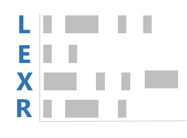

**lexr** is an R package designed to quickly make lexical dispersion
plots. The user will typically be interested in the
`lexical_dispersion_plot` function.

Table of Contents
============

-   [Installation](#installation)
-   [Contact](#contact)
-   [Examples](#examples)
    -   [Reverse facets](#reverse-facets)
    -   [Discourse Markers](#discourse-markers)

Installation
============

To download the development version of **lexr**:

Download the [zip ball](https://github.com/trinker/lexr/zipball/master)
or [tar ball](https://github.com/trinker/lexr/tarball/master),
decompress and run `R CMD INSTALL` on it, or use the **pacman** package
to install the development version:

    if (!require("pacman")) install.packages("pacman")
    pacman::p_load_gh("trinker/lexr")

Contact
=======

You are welcome to: 
* submit suggestions and bug-reports at: <https://github.com/trinker/lexr/issues> 
* send a pull request on: <https://github.com/trinker/lexr/> 
* compose a friendly e-mail to: <tyler.rinker@gmail.com>

Examples
========

A collection of different lexical dispersion plots made with **lexr** +
**qdap** packages.

    if (!require("pacman")) install.packages("pacman"); library(pacman)
    p_load(qdap, lexr)

    term_match(raj$dialogue, c(" love ", "love", " night ", "night"))

    ## $` love `
    ## [1] "love"
    ## 
    ## $love
    ##  [1] "love"           "love's"         "lovers"         "loved"         
    ##  [5] "lovely"         "lovest"         "lover"          "beloved"       
    ##  [9] "loves"          "newbeloved"     "glove"          "lovesong"      
    ## [13] "lovedevouring"  "loveperforming" "dearloved"     
    ## 
    ## $` night `
    ## [1] "night"
    ## 
    ## $night
    ## [1] "night"       "fortnight"   "nights"      "tonight"     "night's"    
    ## [6] "knight"      "nightingale" "nightly"     "yesternight"

    lexical_dispersion_plot(raj$dialogue, c(" love ", "love", " night ", "night"))

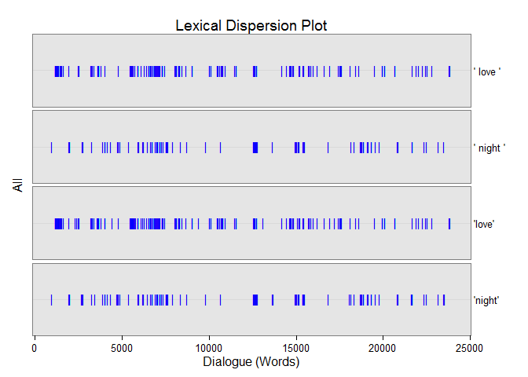

    lexical_dispersion_plot(raj$dialogue, c("love", "night"), dispersion_plo = raj$act)

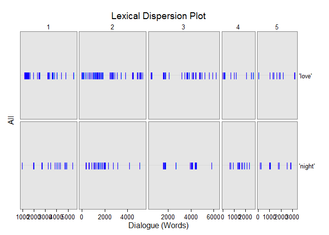

    with(rajSPLIT , lexical_dispersion_plot(dialogue, c("love", "night"),
        grouping.var = list(fam.aff, sex), dispersion_plo = act))

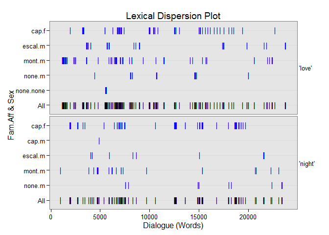

    ## With grouping variables
    with(rajSPLIT , lexical_dispersion_plot(dialogue, c("love", "night"),
         grouping.var = sex, dispersion_plo = act))

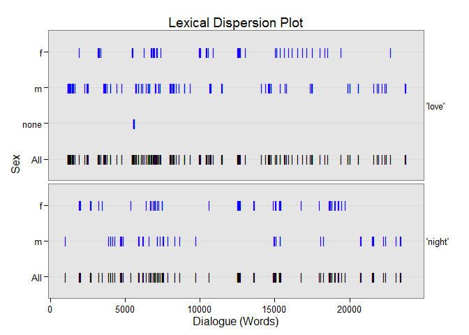

    ## Drop total with `total.color = NULL`
    with(rajSPLIT , lexical_dispersion_plot(dialogue, c("love", "night"),
         grouping.var = sex, dispersion_plo = act, total.color = NULL))

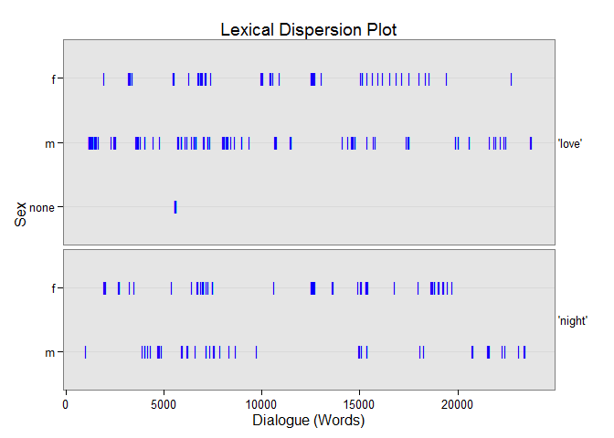

    ## Change color scheme
    with(rajSPLIT, lexical_dispersion_plot(dialogue, c("love", "night"),
        bg.color = "black", grouping.var = list(fam.aff, sex),
        color = "yellow", total.color = "white", horiz.color="grey20"))

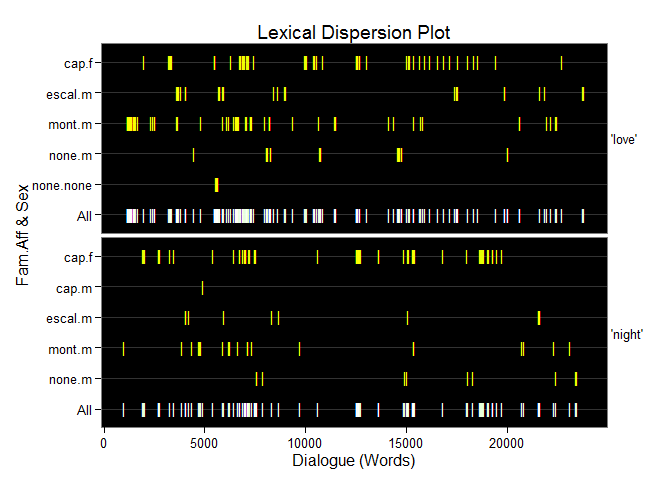

    ## Use `word_list`
    ## Presidential debates by all
    wrds <- word_list(pres_debates2012$dialogue, stopwords = Top200Words)
    wrds2 <- spaste(wrds[["rfswl"]][["all"]][, "WORD"])
    wrds2 <- c(" governor romney ", wrds2[-c(3, 12)])
    with(pres_debates2012 , lexical_dispersion_plot(dialogue, wrds2, , time))

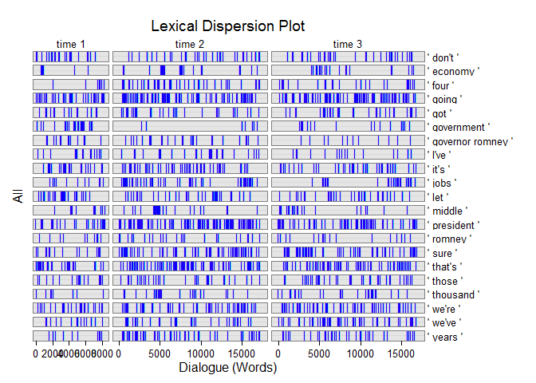

    ## Presidential debates by person
    dat <- pres_debates2012
    dat <- dat[dat$person %in% qcv(ROMNEY, OBAMA), ]

    wordlist <- c(" tax", " health", " rich ", "america", " truth",
        " money", "cost", " governnor", " president", " we ",
        " job", " i ", " you ", " because ", " our ", " years ")

    with(dat, lexical_dispersion_plot(dialogue, wordlist, total.color = NULL,
        bg.color = "white", grouping.var = person, dispersion_plo = time,
        color = "black", horiz.color="grey80"))

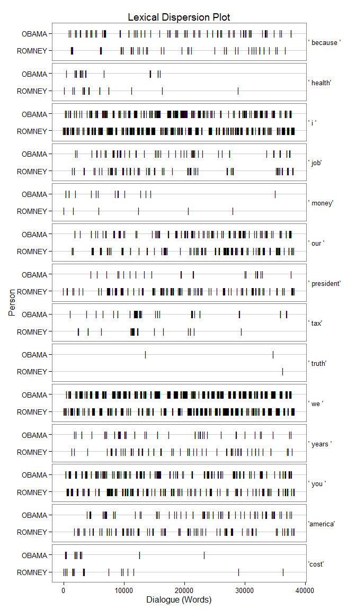

    wordlist2 <- c(" i'd ", " i'll ", " i'm ", " i've ", " i ",
        " we'd ", " we'll ", " we're ", " we've ", " we ",
        " you'd ",  " you'll ", " you're ", " you've ", " you ", " your ",
        " he'd ", " he'll ", " he's ", " he ")

    with(dat, lexical_dispersion_plot(dialogue, wordlist2,
        bg.color = "black", grouping.var = person, dispersion_plo = time,
        color = "yellow", total.color = NULL, horiz.color="grey20"))

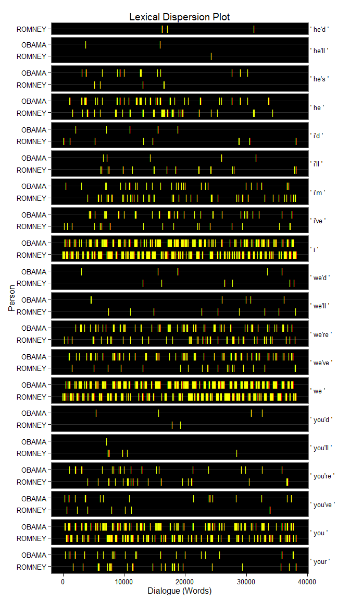

    with(dat, lexical_dispersion_plot(dialogue, wordlist2,
        bg.color = "black", grouping.var = person, dispersion_plo = time,
        color = "red", total.color = "white", horiz.color="grey20"))

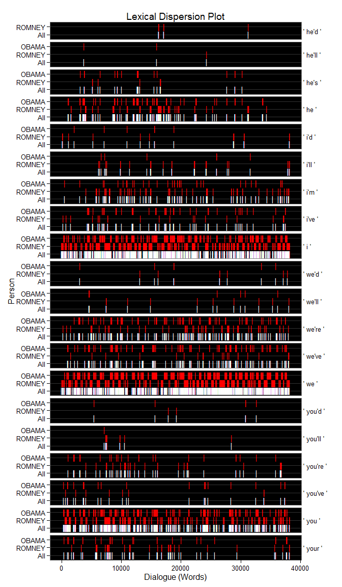

    ## `match.terms` as a named list
    wordlist3 <- list(
        I = c(" i'd ", " i'll ", " i'm ", " i've ", " i "),
        we = c(" we'd ", " we'll ", " we're ", " we've ", " we "),
        you = c(" you'd ",  " you'll ", " you're ", " you've ", " you ", " your "),
        he = c(" he'd ", " he'll ", " he's ", " he ")
    )

    with(dat, lexical_dispersion_plot(dialogue, wordlist3,
        bg.color = "grey60", grouping.var = person, dispersion_plo = time,
        color = "blue", total.color = "grey40", horiz.color="grey20"))

Reverse facets
--------------

    x <- with(pres_debates2012 , lexical_dispersion_plot(dialogue, wrds2, dispersion_plo = time))

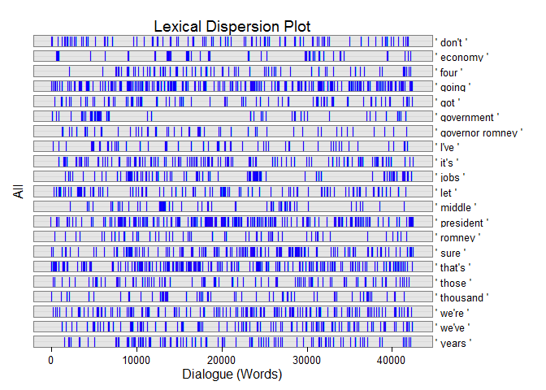

    ## function to reverse ggplot2 facets
    rev_facet <- function(x) {
        names(x$facet)[1:2] <- names(x$facet)[2:1]
        print(x)
    }

    rev_facet(x)

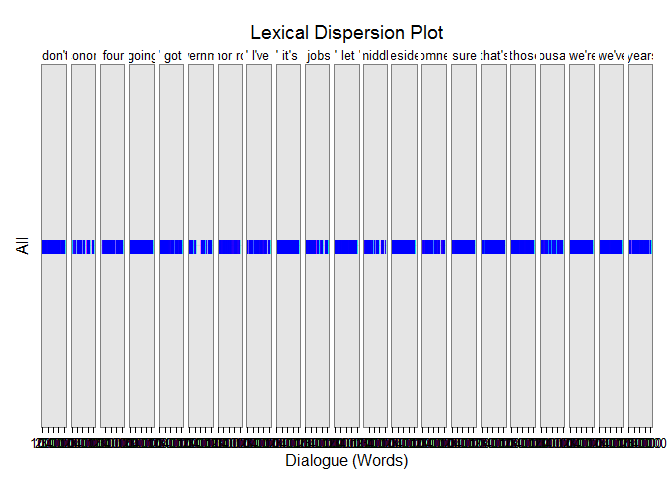

Discourse Markers
-----------------

Schiffrin, D. (2001). Discourse markers: Language, meaning, and
context.  
 In D. Schiffrin, D. Tannen, & H. E. Hamilton (Eds.), The handbook of  
 discourse analysis (pp. 54-75). Malden, MA: Blackwell Publishing.

    discoure_markers <- list(
        response_cries = c(" oh ", " ah ", " aha ", " ouch ", " yuk "),
        back_channels = c(" uh-huh ", " uhuh ", " yeah "),
        summons = " hey ",
        justification = " because "
    )

    (markers <- with(pres_debates2012,
        termco(dialogue, list(person, time), discoure_markers)
    ))

    ##         person&time word.count response_cries back_channels summons justification
    ## 1    CROWLEY.time 2       1672              0             0       0      12(.72%)
    ## 2     LEHRER.time 1        765        1(.13%)       3(.39%)       0             0
    ## 3      OBAMA.time 1       3598              0             0       0      26(.72%)
    ## 4      OBAMA.time 2       7476        1(.01%)             0       0      28(.37%)
    ## 5      OBAMA.time 3       7241              0       1(.01%)       0      33(.46%)
    ## 6   QUESTION.time 2        583        2(.34%)             0       0       2(.34%)
    ## 7     ROMNEY.time 1       4085              0             0 1(.02%)       8(.20%)
    ## 8     ROMNEY.time 2       7534              0       3(.04%)       0      20(.27%)
    ## 9     ROMNEY.time 3       8302        1(.01%)             0 1(.01%)      19(.23%)
    ## 10 SCHIEFFER.time 3       1445              0             0       0       6(.42%)

    plot(markers, high="red")

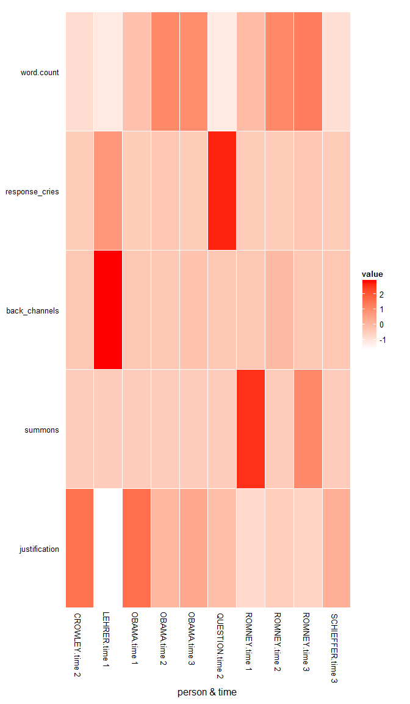

    with(pres_debates2012,
        lexical_dispersion_plot(dialogue, discoure_markers, person, time)
    )

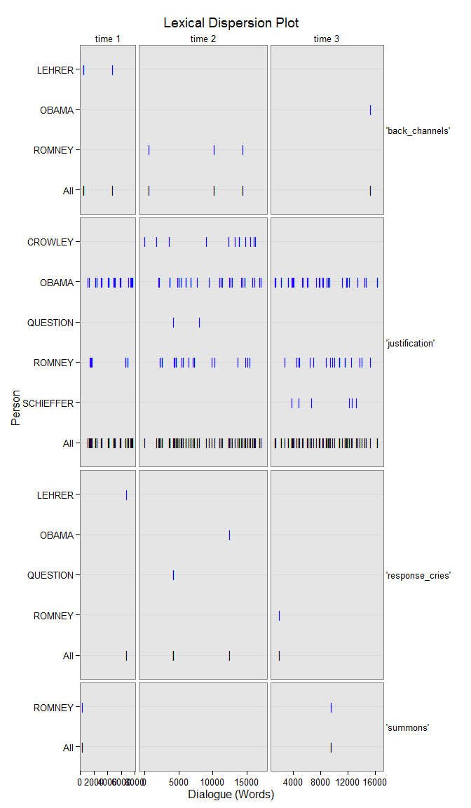